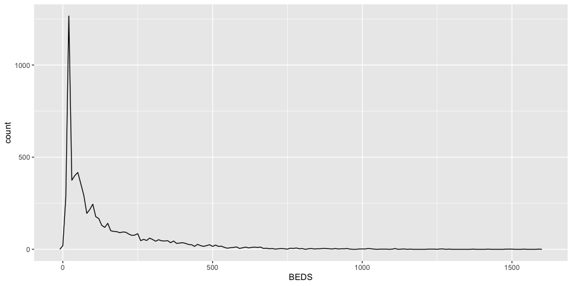
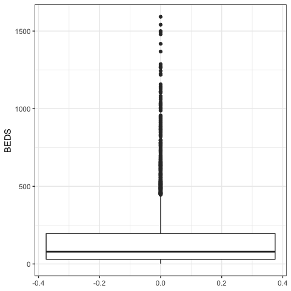
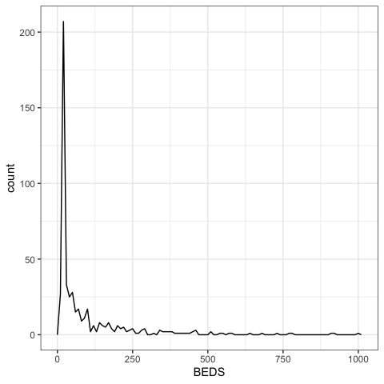
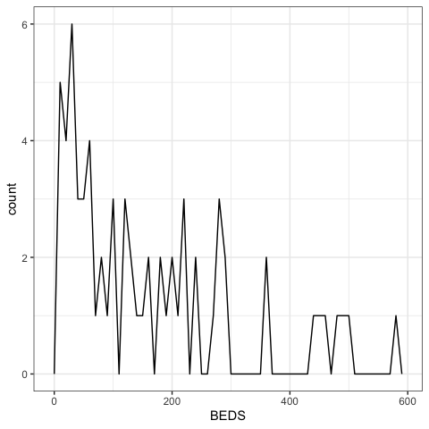
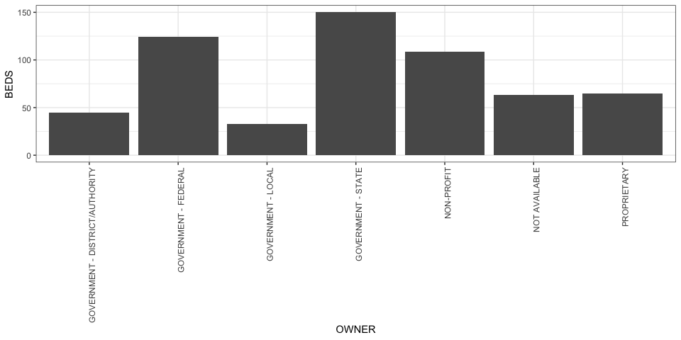
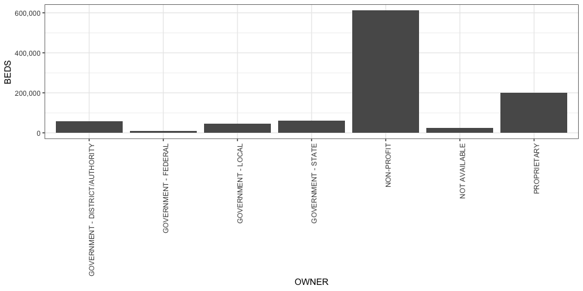
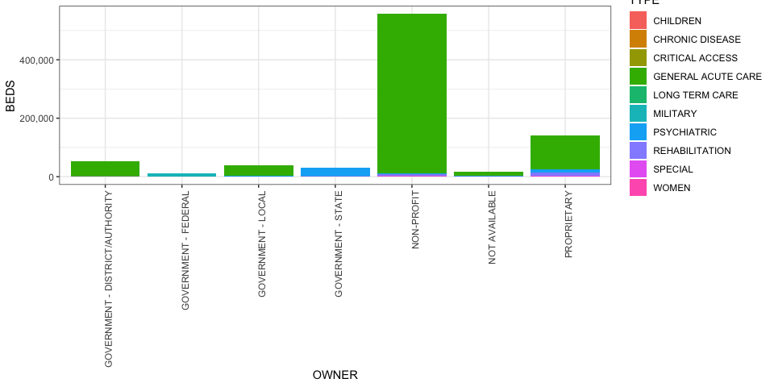
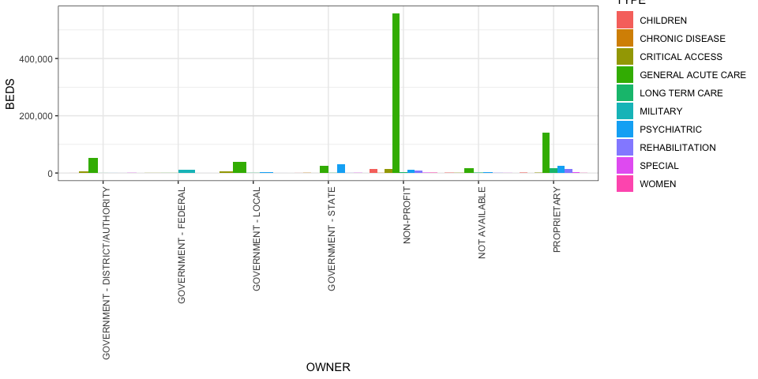
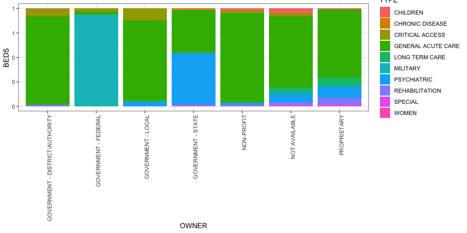

Lab 6 - Qunatitative Insights
================

  - [Instructions and Overview](#instructions-and-overview)
  - [Getting Started](#getting-started)
  - [Measures of Central Tendency](#measures-of-central-tendency)
  - [Measures of Dispersion](#measures-of-dispersion)
  - [Grouped Quantitative Insights](#grouped-quantitative-insights)
  - [Continue your shiny app.](#continue-your-shiny-app.)

## Instructions and Overview

In class, we have been discussing how to calculate and intepret measures
of central tendency and measures of dispersion, as well as the
consequences of relying on such numbers out of context to represent
complex problems. This assignment will apply these ideas to your own
dataset. To begin you will need to import and clean your dataset, and
then you will follow the prompts while responding to short answer
questions. Examples have been provided to support you throughout the
process. At the end of the assignment, we will integrate some of your
calculations into the Shiny application you started last
    week.

## Getting Started

### Load the relevant libraries

``` r
library(tidyverse)
```

    ## ── Attaching packages ───────────────────────────────────────────────────────────────────── tidyverse 1.2.1 ──

    ## ✔ ggplot2 3.2.0     ✔ purrr   0.3.3
    ## ✔ tibble  2.1.3     ✔ dplyr   0.8.3
    ## ✔ tidyr   0.8.3     ✔ stringr 1.4.0
    ## ✔ readr   1.3.1     ✔ forcats 0.4.0

    ## ── Conflicts ──────────────────────────────────────────────────────────────────────── tidyverse_conflicts() ──
    ## ✖ dplyr::filter() masks stats::filter()
    ## ✖ dplyr::lag()    masks stats::lag()

``` r
library(lubridate)
```

    ## 
    ## Attaching package: 'lubridate'

    ## The following object is masked from 'package:base':
    ## 
    ##     date

``` r
library(shiny)
library(shinydashboard)
```

    ## 
    ## Attaching package: 'shinydashboard'

    ## The following object is masked from 'package:graphics':
    ## 
    ##     box

``` r
library(shinyWidgets)
```

### Import your dataset

``` r
setwd("/Users/lpoirier/Documents/GitHub/STS-115")
hospitals <- read.csv("datasets/Hospitals.csv", stringsAsFactors = FALSE)
  
#Copy and paste relevant code from Lab 4 to import your data here. 
```

### Clean your dataset

``` r
is.na(hospitals) <- hospitals == -999

#Copy and paste relevant code from Lab 4 to clean your data here. This includes any row binding, character removals, converions in variable type, date formatting, or NA conversions. 
```

## Measures of Central Tendency

A measure of central tendency is a single numeric quantity describing
data by identifying a central position within it. In this lab, we will
calculate the mean and the median of values within our data. Under
certain circumstances, one of these measurements can be more appropriate
than the other for summarizing data. The frequency plots that we
produced last week will help us to determine which measurement is more
appropriate. Be sure to have them on hand to review as we move through
this part of the assignment.

### Mean

The most common measure of central tendency is a *mean* - the sum of a
series of values divided by the number of values summed. This measure
considers every value in a set of data and thus is a model of the entire
set of data. Let’s calculate the mean of a numeric variable in your
dataset.

``` r
#df %>% summarize(mean_value = mean(NUMERIC_VARIABLE, na.rm = TRUE))

hospitals %>% 
  summarize(mean_value = mean(BEDS, na.rm = TRUE))
```

    ##   mean_value
    ## 1   146.5689

``` r
#Fill your code here. 
```

> Note how we are choosing to ignore NA values above by calling na.rm =
> TRUE. When we do so, we need to keep in mind that we are not
> summarizing across all observations in the dataset, but only those for
> which there is a value listed in the variable we are operating on. Why
> might it be important to make communicate that we’ve made this move
> when we are presenting our data?

### Median

Another measure of central tendency considers to the middle value in a
dataset; this is referred to as the *median*. Let’s calculate the median
of a numeric variable in your dataset.

``` r
#df %>% summarize(median_value = median(NUMERIC_VARIABLE, na.rm = TRUE))

hospitals %>% 
  summarize(median_value = median(BEDS, na.rm = TRUE))
```

    ##   median_value
    ## 1           79

``` r
#Fill your code here. 
```

You’ll notice in the hospitals dataset, there’s a considerable
difference between the mean and the median value. So which should we
rely on to summarize the central location in our dataset?

We want to keep in mind that because the mean is a model of the entire
dataset, it is easily influenced by outliers in the dataset, as well as
a skewed distribution. When the distribution of values in a variable is
normal, the mean and median of the dataset will be the same, because the
values on either side of the middle value will be symmetrical. In other
words, the distirbution will be balanced on either side of the median.
Frequency plots gave us a good indication of the distribution of values
the dataset. Create a frequency plot of the numeric variable you
produced calculations of above. (You may have created this last week,
and you may copy and paste it from the previous lab.)

``` r
hospitals %>% 
  ggplot(aes(x = BEDS)) +
  geom_freqpoly(binwidth = 10)
```

    ## Warning: Removed 662 rows containing non-finite values (stat_bin).

<!-- -->

``` r
#Create a frequency plot here. 
```

You’ll notice in the hospitals dataset, the values of beds are
significantly right-skewed. We can tell because the values represented
on the plot are far from symmetrical. Instead, there is a long tail
running to the right of the data, indicating that, while a considerable
majority of hospitals have fewer than 500 beds available, there are at
least a few hospitals that have up to 1600 beds available. In such
cases, the mean is going to be significantly influenced by the larger
values in the data even though there are far fewer.

Characterize the distribution of values in the frequency plot you
created. Is it symmetrical or skewed?

``` r
Fill your response here. 
```

When the values in a frequency plot are skewed to the left or the right,
we often want to rely on the median rather than the mean as a measure of
central tendency, as it more clearly distinguishes the central location
in the data. In the hospitals dataset, median is a better indicator of
central tendency than the mean. Which value is more appropriate as a
measure of central tendency in your data?

``` r
Fill your response here. 
```

Charaterize the extent to which the value you selected as a measure of
central tendency above is representative of your data. What story is
told when we rely on this number as a summary of the data? If we were to
use this single value to summarize this variable, what narratives would
be left out?

``` r
Fill your response here. 
```

Note that we can see all of the values we calculated above with the
summary() function. Select another numeric variable in your dataset and
call summary() on it.

``` r
#df %>% select(NUMERIC_VARIABLE) %>% summary()

hospitals %>% 
  select(POPULATION) %>% 
  summary()
```

    ##    POPULATION    
    ##  Min.   :   2.0  
    ##  1st Qu.:  30.0  
    ##  Median :  79.0  
    ##  Mean   : 146.8  
    ##  3rd Qu.: 196.0  
    ##  Max.   :1592.0  
    ##  NA's   :702

What story do these calculations tell? Would you select the median or
the mean as a measure of central tendency? Why?

``` r
Fill your response here. 
```

Charaterize the extent to which the value you selected as a measure of
central tendency above is representative of your data. If we were to use
this single value to summarize this variable, what narratives would be
left out?

``` r
Fill your response here. 
```

As we’ve been discussing in class, any measure that we comprehend is
guided in part by the way we have defined the phenomena we are
measuring. How was the numeric variable that you selected defined? What
is included in this definition, and what potentially relevant values are
excluded?

``` r
Fill your response here. 
```

Who has stakes in how this variable gets defined? In what way might
these stakes influence the measures that we have calculated?

``` r
Fill your response here. 
```

## Measures of Dispersion

Measures of dispersion help us to understand how spread out the values
in our dataset are - their variations from each other and from the
data’s mean.

### Ranges

Select a numeric variable in your dataset and calculate the maximum
value, the minimum value, and the range of values within that variable.

``` r
#df %>% summarize(max_value = max(NUMERIC_VARIABLE, na.rm = TRUE))

hospitals %>% 
  summarize(max_value = max(BEDS, na.rm = TRUE))
```

    ##   max_value
    ## 1      1592

``` r
#Fill your code here. 
```

``` r
#df %>% summarize(min_value = min(NUMERIC_VARIABLE, na.rm = TRUE))

hospitals %>% 
  summarize(min_value = min(BEDS, na.rm = TRUE))
```

    ##   min_value
    ## 1         2

``` r
#Fill your code here. 
```

``` r
#df %>% summarize(range = max(NUMERIC_VARIABLE, na.rm = TRUE) - min(NUMERIC_VARIABLE, na.rm = TRUE))

hospitals %>% 
  summarize(range = max(BEDS, na.rm = TRUE) - min(BEDS, na.rm = TRUE))
```

    ##   range
    ## 1  1590

``` r
#Fill your code here. 
```

Do the numbers surprise you? What insight can you draw from this
calculation?

``` r
Fill your response here. 
```

### Quartile Deviation

Even though we are introducing the boxplot in relation to quartile
deviation, it can be a tool for summarizing a number of quantitative
insights in relation to a numerical variable in our dataset. Boxplots
provide a visual representation of both measures of central tendency and
measures of dispersion. The center line in a boxplot indicates the
median of the dataset. The bottom of the box represents the 1st quartile
- the value in the middle of the minimum and the median (or the the
value at the 1st quarter position). The top of the box represents the
3rd quartile - the value in the middle of the median and the maximum (or
the value at the 3rd quarter position). The whiskers include almost all
of the data - indicating its range from minimum to maximum excluding
outliers. The dots represent outliers. ggplot has a calculation for
outliers that we need not go into in this course.

The further the 1st and 3rd quartile are from the median (or, in other
words, the wider the box), the greater the *quartile deviation.* In
general, a narrower box and whiskers indicates less dispersion in the
data, while a wider box and whiskers indicates greater dispersion. Let’s
create a boxplot for one of your numeric variables below.

``` r
#df %>% ggplot(aes(y = NUMERIC_VARIABLE)) + geom_boxplot() + theme_bw()

hospitals %>%
  ggplot(aes(y = BEDS)) +
  geom_boxplot() +
  theme_bw()
```

    ## Warning: Removed 662 rows containing non-finite values (stat_boxplot).

<!-- -->

``` r
#Fill your plot here. Be sure to add a title and labels to your plot. 
```

What insight can you draw from the plot you created?

``` r
Fill your response here. 
```

### Standard Deviation

*Standard deviation* calculates the extent of concentration of values
around the mean. A higher standard deviation indicates that values are
more dispersed from the mean, and a lower standard deviation indicates
that values are more concentrated around the mean. Let’s calculate the
standard deviation with your data.

``` r
#df %>% summarize(sd_value = sd(NUMERIC_VALUE, na.rm = TRUE))

hospitals %>% 
  summarize(sd_value = sd(BEDS, na.rm = TRUE))
```

    ##   sd_value
    ## 1 176.3948

What insight can you draw from this calculation?

``` r
Fill your response here. 
```

Now that you have a sense of the dispersion of some of the values in
your data, why do you believe the values are as concentrated or
dispersed as they are? What do the measures of dispersion you calculated
say about social, political, or economic life in the area the data is
representing? You may need to do some research to answer this question.
For instance, noting the dispersion of beds in the hospitals data, I may
do a Web search for “Why do some hospitals in the US have more beds than
others?” and find
[this](https://www.nytimes.com/interactive/2020/03/17/upshot/hospital-bed-shortages-coronavirus.html)
article. Be sure to assess the reputability of your source and cite it
in your response below.

``` r
Fill your response here. 
```

## Grouped Quantitative Insights

Like we learned in regards to co-variation, some of the most interesting
information we can gain from our data is how values change depending on
where in the data we are looking.

ggplot’s geom\_boxplot feature is particularly good at comparing
measures of dispersion across grouped values in a categorical variable.
It is set up to visualize several boxplots side-by-side. Let’s take a
look at how we could compare dispersions in the number of hospital beds
available by hospital
ownership.

``` r
#df %>% ggplot(aes(x = CATEGORICAL_VARIABLE, y = NUMERIC_VARIABLE)) + geom_boxplot()

hospitals %>%
  ggplot(aes(x = OWNER, y = BEDS)) +
  geom_boxplot() +
  theme_bw() +
  theme(axis.text.x = element_text(angle = 90, hjust=1)) + #Changes x-axis tick labels 90 degrees
  coord_flip() #Flips the x and y axis to make the data easier to read and compare
```

    ## Warning: Removed 662 rows containing non-finite values (stat_boxplot).

<!-- -->

We see above that there is a greater dispersion in the number of beds
available at state hospitals, non-profit hospitals, and federal
hospitals. We also see that, in local hospitals, the median is very
close to the first quartile, indicating that the data is going to be
considerably right-skewed. Compare this to federal hospitals, where the
median is more centered in the box (and there are few outliers). We are
likely to see a bit more of a normal distribution in this data. Let’s
confirm this.

``` r
hospitals %>%
  filter(OWNER == "GOVERNMENT - LOCAL") %>%
  ggplot(aes(x = BEDS)) +
  geom_freqpoly(binwidth = 10) +
  theme_bw()
```

    ## Warning: Removed 5 rows containing non-finite values (stat_bin).

<!-- -->

``` r
hospitals %>%
  filter(OWNER == "GOVERNMENT - FEDERAL") %>%
  ggplot(aes(x = BEDS)) +
  geom_freqpoly(binwidth = 10) +
  theme_bw()
```

    ## Warning: Removed 199 rows containing non-finite values (stat_bin).

<!-- -->

Create a grouped boxplot for your dataset below.

``` r
#Fill your code here. Add a title and labels to your plot. 
```

Summarize what you learn from the plot.

``` r
Fill your response here. 
```

How does the story that this grouped boxplot tells differ from the story
told by the single boxplot you created above? Interpret why the story
differs.

``` r
Fill your response here. 
```

Sometimes, we also want to graphically represent a calculation that we
perform for a grouped categorical variable. For instance, let’s say I
wanted to show the median number of beds available grouped by the
hospital owner. To do this, I need to calculate the median of the BEDS
variable for each OWNER. One way to do this is to group\_by(OWNER),
summarize the median of BEDS, and then plot the resulting data frame. We
discussed how to group\_by() and summarize() in lab 4, and a ggplot call
can be appended to these functions with a pipe (%\>%) to plot them.
However, here we can also use stat\_summary(), in conjunction with a
function. We will plot the median as a column plot by setting the geom =
“col”.

``` r
#df %>% ggplot(aes(x = CATEGORICAL_VARIABLE, y = NUMERIC_VARIABLE)) + stat_summary(geom = "col", fun.y = "median")

hospitals %>%
  ggplot(aes(x = OWNER, y = BEDS)) +
  stat_summary(geom = "col", fun.y = "median") +
  theme_bw() + # To change the plot theme
  theme(axis.text.x = element_text(angle = 90, hjust=1)) + # To turn x-axis ticks 90 degrees
  scale_y_continuous(labels = scales::comma)  # To set x-axis ticks to comma notation
```

    ## Warning: Removed 662 rows containing non-finite values (stat_summary).

<!-- -->

We can apply functions other than median in stat\_summary(). Let’s
graphically represent the total number of beds for each owner.

``` r
hospitals %>%
  ggplot(aes(x = OWNER, y = BEDS)) +
  stat_summary(geom = "col", fun.y = "sum") + #fun.y tells ggplot to perform this function on the y-variable
  theme_bw() + # To change the plot theme
  theme(axis.text.x = element_text(angle = 90, hjust=1)) + # To turn x-axis ticks 90 degrees
  scale_y_continuous(labels = scales::comma)  # To set x-axis ticks to comma notation
```

    ## Warning: Removed 662 rows containing non-finite values (stat_summary).

<!-- -->

I can group these calculations further using the *fill* aesethetic.
Below we create three plots by setting the fill aesthetic to the
hospitals’ TYPE. Depending on the *position* attribute, we can create
either a stacked column plot, a dodged column plot, or a filled column
plot (which shows proportions of totals versus actual totals. )

``` r
#Stacked column plot of the total hospital beds by owner and type
hospitals %>%
  ggplot(aes(x = OWNER, y = BEDS, fill = TYPE)) +
  stat_summary(geom = "col", fun.y = "sum") +
  theme_bw() + # To change the plot theme
  theme(axis.text.x = element_text(angle = 90, hjust=1)) + # To turn x-axis ticks 90 degrees
  scale_y_continuous(labels = scales::comma)  # To set x-axis ticks to comma notation
```

    ## Warning: Removed 662 rows containing non-finite values (stat_summary).

<!-- -->

``` r
#Dodged column plot of the total hospital beds by owner and type
hospitals %>%
  ggplot(aes(x = OWNER, y = BEDS, fill = TYPE)) +
  stat_summary(geom = "col", fun.y = "sum", position = "dodge") +
  theme_bw() + # To change the plot theme
  theme(axis.text.x = element_text(angle = 90, hjust=1)) + # To turn x-axis ticks 90 degrees
  scale_y_continuous(labels = scales::comma)  # To set x-axis ticks to comma notation
```

    ## Warning: Removed 662 rows containing non-finite values (stat_summary).

<!-- -->

``` r
#Filled column plot of the total hospital beds by owner and type
hospitals %>%
  ggplot(aes(x = OWNER, y = BEDS, fill = TYPE)) +
  stat_summary(geom = "col", fun.y = "sum", position = "fill") +
  theme_bw() + # To change the plot theme
  theme(axis.text.x = element_text(angle = 90, hjust=1)) + # To turn x-axis ticks 90 degrees
  scale_y_continuous(labels = scales::comma)  # To set x-axis ticks to comma notation
```

    ## Warning: Removed 662 rows containing non-finite values (stat_summary).

<!-- -->

Using stat\_summary() in conjunction with a function, create three
column plots below. If using the sum function, experiment with the fill
and the position.

``` r
#Create your first plot here. Be sure to add a title and labels. 
```

``` r
#Create your second plot here. Be sure to add a title and labels. 
```

``` r
#Create your third plot here. Be sure to add a title and labels. 
```

Summarize what you learn from these three plots.

``` r
Fill your response here. 
```

Which social groups might be interested in each of the plots that you
produced? Why would they be interested in these plots?

``` r
Fill your response here. 
```

## Continue your shiny app.

Now we will incorporate some of the values we calculated and some of the
plots we produced above into the Shiny App. In the server function,
follow the instructions in the comments to create three value boxes in
your app. You will also place two more plots in the app. Don’t worry
about styling the app. That will be the focus of a later lab.

``` r
ui <- dashboardPage(
  
  dashboardHeader(title = "TITLE HERE"),
  
  dashboardSidebar(
    #inputs will go here. 
  ),
  
  dashboardBody(
      infoBoxOutput("value1", width = 4),
      infoBoxOutput("value2", width = 4),
      infoBoxOutput("value3", width = 4),
      plotOutput("plot1"),
      plotOutput("plot2"),
      plotOutput("plot3"),
      plotOutput("plot4")
  )
)
```

``` r
server <- function(input, output, session) {
  
  output$value1 <- renderInfoBox({
    quant_insight1 <- 0
    #Replace '0' above with the code for one of the values you calculated above. Replace 'FILL DESCRIPTION HERE' with a brief description of this number.  
    infoBox(quant_insight1,'FILL DESCRIPTION HERE', icon = icon("stats", lib='glyphicon'), color = "purple")
  })
  
  output$value2 <- renderInfoBox({
    quant_insight2 <- 0
    #Replace '0' above with the code for one of the values you calculated above. Replace 'FILL DESCRIPTION HERE' with a brief description of this number.  
    infoBox(quant_insight2,'FILL DESCRIPTION HERE', icon = icon("stats", lib='glyphicon'), color = "purple")
  })
  
  output$value3 <- renderInfoBox({
    quant_insight3 <- 0
    #Replace '0' above with the code for one of the values you calculated above. Replace 'FILL DESCRIPTION HERE' with a brief description of this number.  
    infoBox(quant_insight3,'FILL DESCRIPTION HERE', icon = icon("stats", lib='glyphicon'), color = "purple")
  })
  
  
  output$plot1 <- renderPlot({
    hospitals %>% ggplot(aes(x = TYPE)) + geom_bar()
    #Replace plot above with your own plot. 
    
  })
  
  output$plot2 <- renderPlot({
    hospitals %>% ggplot(aes(x = TYPE)) + geom_bar()
    #Replace plot above with your own plot. 
  })
  
  output$plot3 <- renderPlot({
    hospitals %>% ggplot(aes(x = TYPE)) + geom_bar()
    #Replace plot above with your own plot. 
    
  })
  
  output$plot4 <- renderPlot({
    hospitals %>% ggplot(aes(x = TYPE)) + geom_bar()
    #Replace plot above with your own plot. 
  })
  
}
```

``` r
shinyApp(ui, server)
```

<!--html_preserve-->

<div class="muted well" style="width: 100% ; height: 400px ; text-align: center; box-sizing: border-box; -moz-box-sizing: border-box; -webkit-box-sizing: border-box;">

Shiny applications not supported in static R Markdown documents

</div>

<!--/html_preserve-->
