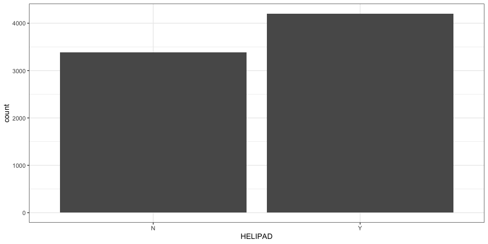
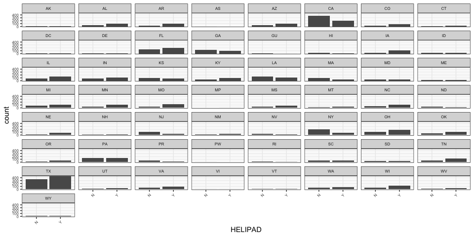
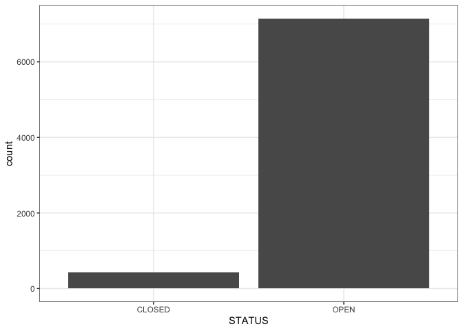
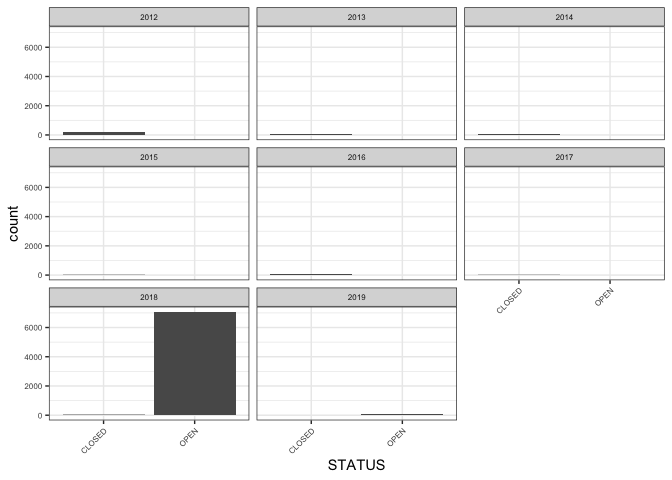

Lab 7 - Geographic and Temporal Context
================

  - [Instructions and Overview](#instructions-and-overview)
  - [Getting Started](#getting-started)
  - [Facets](#facets)
  - [The Importance of Place and
    Time](#the-importance-of-place-and-time)
  - [Confounding Variables](#confounding-variables)
  - [Continue your shiny app.](#continue-your-shiny-app.)

## Instructions and Overview

At this point in the quarter, we have produced a number of plots and
calculate a number of measures in regards to our data. Now, we’re going
to explore in more depth how the stories the data tell change depending
on where we look. This exploration will turn into user inputs in our
Shiny
    app.

## Getting Started

### Load the relevant libraries

``` r
library(tidyverse)
```

    ## ── Attaching packages ───────────────────────────────────────────────────────────────────── tidyverse 1.2.1 ──

    ## ✔ ggplot2 3.2.0     ✔ purrr   0.3.3
    ## ✔ tibble  2.1.3     ✔ dplyr   0.8.3
    ## ✔ tidyr   0.8.3     ✔ stringr 1.4.0
    ## ✔ readr   1.3.1     ✔ forcats 0.4.0

    ## ── Conflicts ──────────────────────────────────────────────────────────────────────── tidyverse_conflicts() ──
    ## ✖ dplyr::filter() masks stats::filter()
    ## ✖ dplyr::lag()    masks stats::lag()

``` r
library(lubridate)
```

    ## 
    ## Attaching package: 'lubridate'

    ## The following object is masked from 'package:base':
    ## 
    ##     date

``` r
library(shiny)
library(shinydashboard)
```

    ## 
    ## Attaching package: 'shinydashboard'

    ## The following object is masked from 'package:graphics':
    ## 
    ##     box

``` r
library(shinyWidgets)
```

### Import your dataset

``` r
setwd("/Users/lpoirier/Documents/GitHub/STS-115")
hospitals <- read.csv("datasets/Hospitals.csv", stringsAsFactors = FALSE)
  
#Copy and paste relevant code from Lab 4 to import your data here. 
```

### Clean your dataset

``` r
is.na(hospitals) <- hospitals == -999
hospitals$VAL_DATE <- ymd_hms(hospitals$VAL_DATE)
hospitals$SOURCEDATE <- ymd_hms(hospitals$SOURCEDATE)

#Copy and paste relevant code from Lab 4 to clean your data here. This includes any row binding, character removals, converions in variable type, date formatting, or NA conversions. 
```

## Facets

To get us started in putting our data into context, we are going to look
at some of the plots we produced in previous labs grouped according to a
categorical variable in our dataset.

By *faceting* plots, we split them into a series of panels each
representing the grouped data associated with a particular value in a
categorical variable. Let’s start with an easy example from our
hospitals data - faceting a bar plot of the number of hosptials that
have a helipad by
state.

``` r
#df %>% ggplot(aes(x = CATEGORICAL_VARIABLE)) + geom_bar() + facet_wrap(~CATEGORICAL_VARIABLE)

#without facet_wrap()
hospitals %>% 
  ggplot(aes(x = HELIPAD)) + 
  geom_bar() +
  theme_bw()
```

<!-- -->

``` r
#with facet_wrap()
hospitals %>% 
  ggplot(aes(x = HELIPAD)) + 
  geom_bar() +
  facet_wrap(~STATE) +
  theme_bw() +
  theme(axis.text.x = element_text(angle = 45, hjust=1, size = 6), 
        axis.text.y = element_text(size = 6),
        strip.text = element_text(size = 6)) 
```

<!-- -->

The first plot suggests that more hospitals have helipads than those
that don’t. Grouping this by state, however, we can see that in some
states (like California and New York), more hospitals don’t have
helipads than those that do. Faceting can help us zoom into the data for
more geographic specificity.

Let’s also facet data by a temporal variable. Assuming we have already
converted a date/time variable in our dataset into a data/time format
(using lubridate in lab 4), we should be able to extract a year, month,
day (and if available hour, minute, and second) from the data using
these lubridate functions:

  - year(DATE\_VARIABLE) will extract the year from the date
  - month(DATE\_VARIABLE) will extract the month from the date
  - day(DATE\_VARIABLE) will extract the day from the date
  - … and so on

<!-- end list -->

``` r
#without facet_wrap()
hospitals %>% 
  ggplot(aes(x = STATUS)) + 
  geom_bar() +
  theme_bw()
```

<!-- -->

``` r
#with facet_wrap()
hospitals %>% 
  ggplot(aes(x = STATUS)) + 
  geom_bar() +
  facet_wrap(~year(SOURCEDATE)) +
  theme_bw() +
  theme(axis.text.x = element_text(angle = 45, hjust=1, size = 6), 
        axis.text.y = element_text(size = 6),
        strip.text = element_text(size = 6)) 
```

<!-- --> Faceting this
plot by the year in which the data was sourced helps put the STATUS
field into context. We can see that the vast majority of the data
represented in the plot was sourced in 2018. We know that hospitals
across the country are not open or closed in perpetuity, so we need to
take the temporal context of the data into consideration when presenting
our data.

Copy and paste a plot from one of your previous labs and then copy it
again and facet it by a geographic or temporal
variable.

``` r
#df %>% ggplot(aes(x = CATEGORICAL_VARIABLE)) + geom_bar() + facet_wrap(~CATEGORICAL_VARIABLE)

#Copy and paste a previoulsy created plot here. 

#Copy that plot again and facet it by a geographic or temporal variable. Adjust the theme as I have above to make your plot more legible.  
```

How do the stories that the two plots tell differ? What does your first
plot tell you about the geo-political landscape of the issue you are
studying? - OR - What does the first plot tell you about the temporal
landscape of the issue you are studying?

``` r
Fill your response here. 
```

Repeat the exercise you completed above for a second plot you created in
a previous
lab.

``` r
#df %>% ggplot(aes(x = CATEGORICAL_VARIABLE)) + geom_bar() + facet_wrap(~CATEGORICAL_VARIABLE)

#Copy and paste a previoulsy created plot here. 

#Copy that plot again and facet it by a geographic or temporal variable. Adjust the theme as I have above to make your plot more legible.  
```

How do the stories that the two plots tell differ? What does your second
plot tell you about the geo-political landscape of the issue you are
studying? - OR - What does the second plot tell you about the temporal
landscape of the issue you are studying?

``` r
Fill your response here. 
```

Repeat the exercise you completed above for a third plot you created in
a previous
lab.

``` r
#df %>% ggplot(aes(x = CATEGORICAL_VARIABLE)) + geom_bar() + facet_wrap(~CATEGORICAL_VARIABLE)

#Copy and paste a previoulsy created plot here. 

#Copy that plot again and facet it by a geographic or temporal variable. Adjust the theme as I have above to make your plot more legible. 
```

How do the stories that the two plots tell differ? What does your third
plot tell you about the geo-political landscape of the issue you are
studying? - OR - What does the third plot tell you about the temporal
landscape of the issue you are studying?

``` r
Fill your response here. 
```

## The Importance of Place and Time

Time and place often matter a great deal in how we interpret data. In
this section, we will explore some of the pitfalls we need to avoid when
generalizing data across geographies and across time.

A few examples to get us started:

### Case Study 1: Covid-19 Case Reporting by Country

### Case Study 2: Calls to 311 during Hurricane Sandy

> Further Reading:

311 is basically a customer service number for cities - a number for
residents and visitors to report non-emergency issues, such as potholes
and graffiti to city officials. In most cities, every call to 311 gets
aggregated in a database, and increasingly, city officials are
performing data analysis on the calls to figure out where certain issues
in the city are concentrated. If they receive a number of calls about
missed garbage pick-ups in a certain community, they may divert
attention and resources there for improved sanitation. Often this data
is publiclly accessible for communities to analyze.

When Hurricane Sandy hit NYC in 2012, the City leveraged data about
calls New Yorkers had made to 311 to track where a number of different
issues were occuring. Visualizing data about 311 calls in the three
months following the disaster indeed showed a spike in complaints about
issues like damaged trees and lack of heat in apartment buildings
throughout the city. Leveraging this data, the city was able to position
the devastation of the disaster as episodic - a result of natural forces
beyond their control.

However, social researchers have argued that it is not so simple to
delimit the temporal boundaries of a disaster. While a natural event may
happen on a particular day or span of days, the structural conditions of
the communities they impact have much longer timespans. Natural events
occurring in delimited periods of time often exacerbate existing social
issues like poverty, lack of affordable housing, and unequal access to
healthcare.

Let’s zoom out on the 311 data to look at these issues over the course
of years versus these three months. Complaints to 311 about damaged
trees do spike following most major natural events. However, complaints
about lack of heat in apartments spike every year in October …because in
New York, that’s when it gets cold. By only look at the data in months
immediately after the disaster, the city could obscure the big picture -
that poor New Yorkers face apartment negligence every year. The temporal
context in which we analyze data matters a great deal for how we
interpret it.

## Confounding Variables

### Population

### Semantic Changes

Even categories that have institutionally standardized are constantly
changing as a result of \_\_\_\_.

## Continue your shiny app.

With this in mind, we are going to add the capacity for users to specify
specific geographies and timeframes when viewing the data in our app.
While I believe all of you have a geography represented in your data,
some of you do not have date and time represented in your data. If this
is the case, you may remove the commented data-time inputs from the code
below.

At this point, we will begin working in the ui code block and creating
more crosstalk between the ui and the server. Users will input
information into the front end of the app, and that input will be
communicated to the server. More specifically, users will select a
geography and a data/timeframe, and the server will filter the dataset
according to the selected features and recreate the values/plots on the
filtered data.

Be sure to follow all commented instructions below to add inputs to your
Shiny app.

``` r
geo_input_choices <- hospitals %>% select(STATE) %>% distinct()
date_input_start <- hospitals %>% select(STATE) %>% distinct()
date_input_end <- hospitals %>% select(STATE) %>% distinct()

ui <- dashboardPage(
  
  dashboardHeader(title = "TITLE HERE"),
  
  dashboardSidebar(
      selectInput(inputId = "geo_val", label = "Select an geography:", choices = geo_input_choices),
      dateRangeInput(inputId = "date_val", label = "Select a date range:", start, end, min, max)
  ),
  
  dashboardBody(
      infoBoxOutput("value1", width = 4),
      infoBoxOutput("value2", width = 4),
      infoBoxOutput("value3", width = 4),
      plotOutput("plot1"),
      plotOutput("plot2"),
      plotOutput("plot3"),
      plotOutput("plot4")
  )
)
```

    ## Warning: Couldn't coerce the `start` argument to a date string with format
    ## yyyy-mm-dd

    ## Warning: Couldn't coerce the `end` argument to a date string with format
    ## yyyy-mm-dd

    ## Warning: Couldn't coerce the `min` argument to a date string with format
    ## yyyy-mm-dd

    ## Warning: Couldn't coerce the `max` argument to a date string with format
    ## yyyy-mm-dd

``` r
server <- function(input, output, session) {
  
  output$value1 <- renderInfoBox({
    hospitals %>% filter(STATE == geo_val)
    quant_insight1 <- 0
    #Replace '0' above with the code for one of the values you calculated above. Replace 'FILL DESCRIPTION HERE' with a brief description of this number.  
    infoBox(quant_insight1,'FILL DESCRIPTION HERE', icon = icon("stats", lib='glyphicon'), color = "purple")
  })
  
  output$value2 <- renderInfoBox({
    quant_insight2 <- 0
    #Replace '0' above with the code for one of the values you calculated above. Replace 'FILL DESCRIPTION HERE' with a brief description of this number.  
    infoBox(quant_insight2,'FILL DESCRIPTION HERE', icon = icon("stats", lib='glyphicon'), color = "purple")
  })
  
  output$value3 <- renderInfoBox({
    quant_insight3 <- 0
    #Replace '0' above with the code for one of the values you calculated above. Replace 'FILL DESCRIPTION HERE' with a brief description of this number.  
    infoBox(quant_insight3,'FILL DESCRIPTION HERE', icon = icon("stats", lib='glyphicon'), color = "purple")
  })
  
  
  output$plot1 <- renderPlot({
    hospitals %>% ggplot(aes(x = TYPE)) + geom_bar()
    #Replace plot above with your own plot. 
    
  })
  
  output$plot2 <- renderPlot({
    hospitals %>% ggplot(aes(x = TYPE)) + geom_bar()
    #Replace plot above with your own plot. 
  })
  
  output$plot3 <- renderPlot({
    hospitals %>% ggplot(aes(x = TYPE)) + geom_bar()
    #Replace plot above with your own plot. 
    
  })
  
  output$plot4 <- renderPlot({
    hospitals %>% ggplot(aes(x = TYPE)) + geom_bar()
    #Replace plot above with your own plot. 
  })
  
}
```

``` r
shinyApp(ui, server)
```

<!--html_preserve-->

<div class="muted well" style="width: 100% ; height: 400px ; text-align: center; box-sizing: border-box; -moz-box-sizing: border-box; -webkit-box-sizing: border-box;">

Shiny applications not supported in static R Markdown documents

</div>

<!--/html_preserve-->
